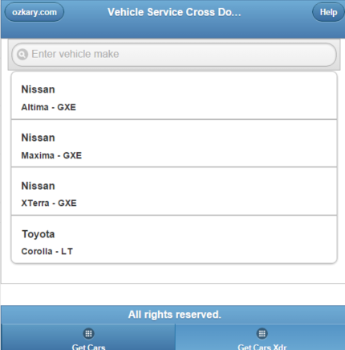

<h1>WCF Rest API With Cross Domain Support</h1>

WCF RESTful services with cross domain support

Press GetCars/GetCarsXdr to do a cross domain request with a complex type. GetCars will fail with "BAD Request" because complex type with POST verbs are not supported. GetCarsXdr handles this limitation by using stream data type.

<h3>Demo</h3>

<h3>Sample Code</h3>
<code>

        /// 

        /// gets all the cars
        /// 

        /// <param name="request"></param>
        /// <returns></returns>
        public Model.CarResponse GetCars(Model.CarRequest req)
        {
            return Data.VehicleData.GetItems(req);
        }

        /// 

        /// cross domain support for complex types
        /// 

        /// <param name="request"></param>
        /// <returns></returns>
        public Model.CarResponse GetCarsXdr(Stream req)
        {
            try
            {
                Model.CarRequest request = MapRequest<Model.CarRequest>(req);
                return GetCars(request);
            }
            catch (System.Exception ex)
            {
                throw new FaultException(ex.Message);
            }
        }       
</code>